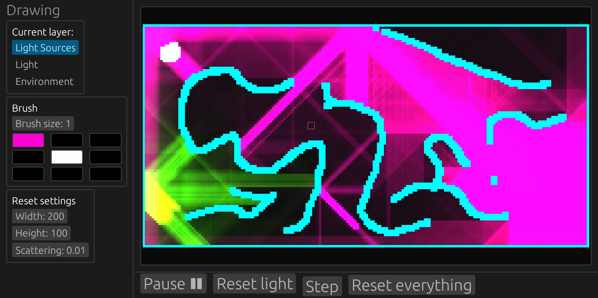
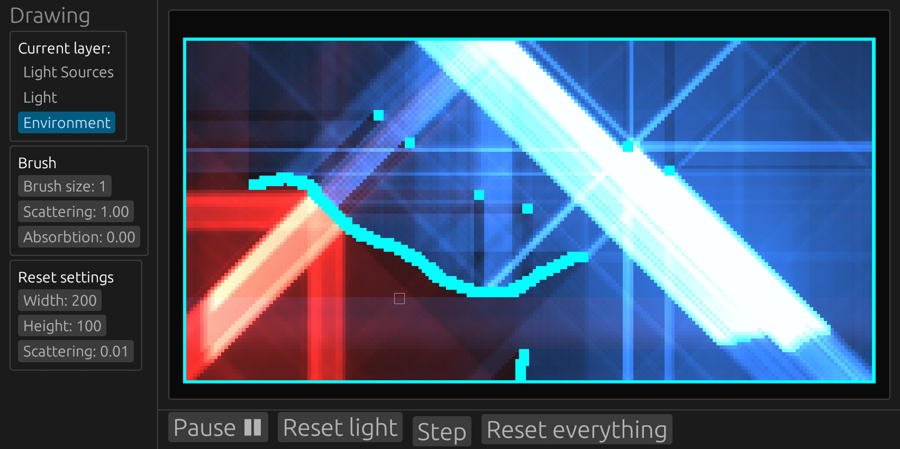

# Cell-based lighting calculations via Lattice-Boltzmann method
Implements a 2D version of 'Geist, Robert, Karl Rasche, James Westall, and Robert J. Schalkoff. "Lattice-boltzmann lighting." Rendering Techniques 355 (2004): 362.'

